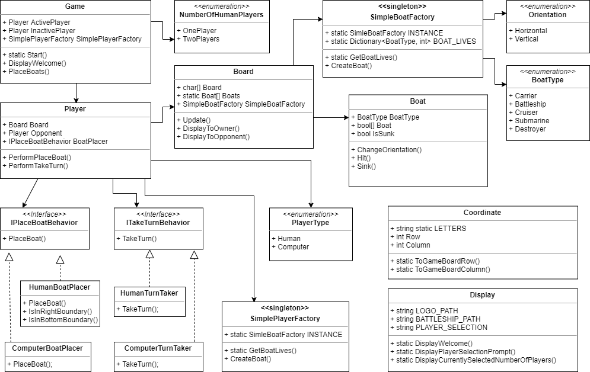

|[README](../README.md)|[How to Play](how-to-play.md)|[Project Architecture](architecture.md)|[User Stories](user-stories.md)|[Change Log](change-log.md)|
|-|-|-|-|-|

# Project Architecture

I tried to utilize some of the design patterns I have been studying and was able to implement the Strategy Pattern, Singletons and Simple Factories (which aren't technically patterns). This definitely made the project more complex than it needed to be but I had fun figuring everything out.