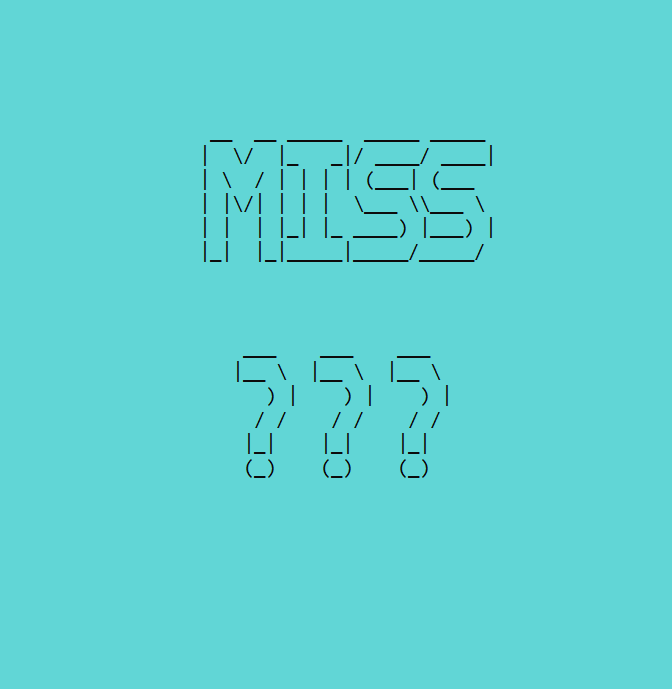

|[README](../README.md)|[How to Play](how-to-play.md)|[Project Architecture](architecture.md)|[User Stories](user-stories.md)|[Change Log](change-log.md)|
|-|-|-|-|-|

# How to Play

For a quick video tutorial on playing the Milton Bradley Battleship game click [here](https://www.youtube.com/watch?v=q0qpQ8doUp8)

## Goal
The goal of the game is to destroy all of your opponents ships before your are sunk.

## Secrets
Throughout the game you will be presented with the a 'secret screen' whose sole purpose is to prevent your opponent from seeing where your ships are placed and vice-versa. When you encounter this screen press any key to continue playing the game.

## Getting Started
After running the app you will be presented with the welcome screen. Use the left and right arrow keys to select either 'One Player' or 'Two Players' and press enter to submit your selection. If you choose 'One Player' you will play against a computer player.

## Placing Boats
You have five ships of varying length to place around the board. Each ship is represented by a series of O's. Use the arrow keys to navigate around the board and you can press the spacebar to toggle between horizontal and vertical orientations. Press enter to place the boat when you are satisfied with its location. The game will not let you place ships that are overlapping nor move a ship outside of the board.

If you are playing against the computer you will place all of your ships and then move immediately into the attacking phase. If you are playing against another person then player one will place all of their ships, then player two will place all of theirs. Make sure your opponent doesn't see where you put your ships!

## Attacking
Once you have moved on to the attack phase each player will take turns entering attack coordinates. Coordinates must consist of a letter a-j and a number 1-10. Press enter to submit the coordinate and you will be presented with either the HIT or MISS screen to let you know... if you hit or missed the opponent's ship.

A miss is signified by the ~ character and a hit is signified by an X.

If you are playing against the computer, during the computer's turn you will see your own board. When the computer attacks the coordinate will flash on the screen.

## End Game
When one player has hit all 17 of their opponents ship occupied spaces the game will end. The winner will be congratulated while the loser must live with the shame of defeat in perpetuity.

